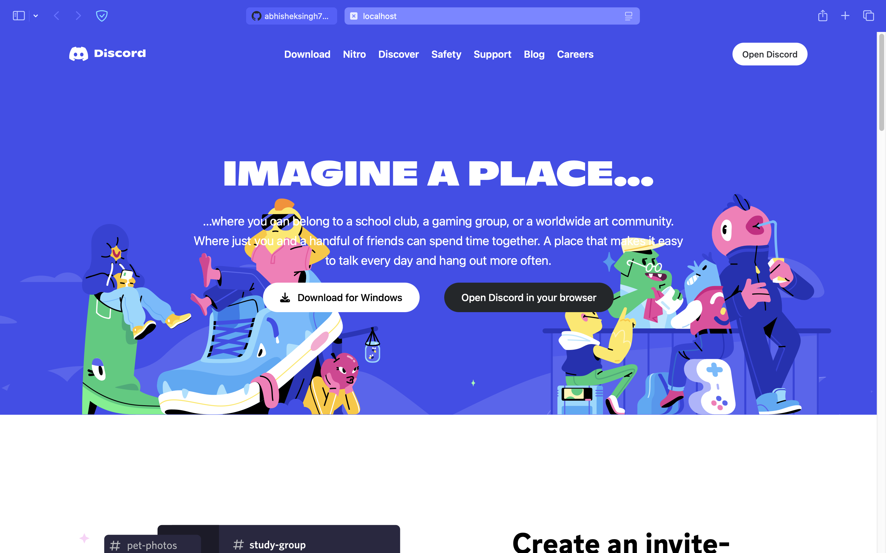

# Discord UI Clone



This project is a clone of the Discord user interface, built with **Tailwind CSS** and **Vite**. It aims to replicate the sleek design and functionality of Discord, providing a modern, responsive chat experience.

## Table of Contents

- [Features](#features)
- [Technologies](#technologies)
- [Installation](#installation)
- [Usage](#usage)
- [Contributing](#contributing)
- [License](#license)

## Features

- Responsive design
- Custom user interface
- Interactive chat components
- Built with Tailwind CSS for utility-first styling

## Technologies

- **Tailwind CSS**: A utility-first CSS framework.
- **Vite**: A fast development server and build tool.

## Installation

1. Clone the repository:

   ```bash
   git clone https://github.com/abhisheksingh789/Discord-UI-With-Tailwind.git
   cd Discord-UI-With-Tailwind
   ```

2. Install dependencies:

   ```bash
   npm install
   ```

3. Start the development server:

   ```bash
   npm start
   ```

4. Open your browser and visit [http://localhost:5173](http://localhost:5173).

## Usage

Feel free to explore the code and customize the components. The project structure is straightforward, with Tailwind's configuration files set up for easy styling adjustments.

## Contributing

Contributions are welcome! If you have suggestions or improvements, please fork the repository and create a pull request.

## License

This project is licensed under the MIT License. See the [LICENSE](LICENSE) file for more details.